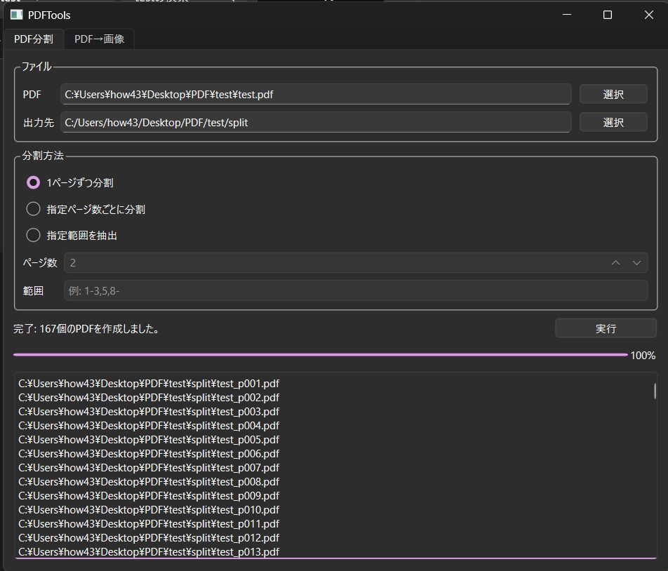
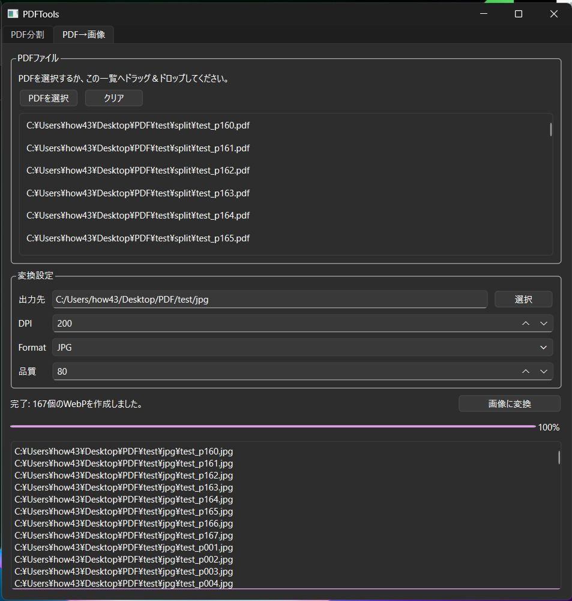
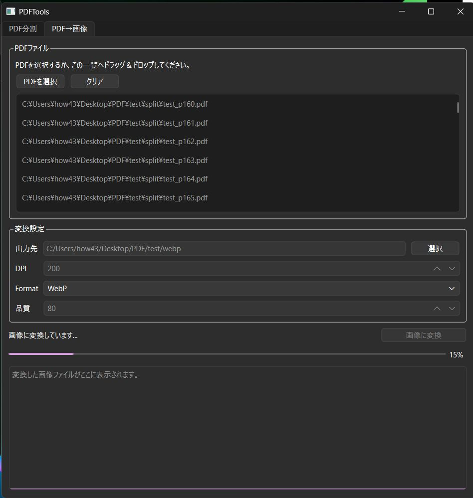

# PDFTools

A desktop application for splitting PDF files and converting PDFs into image formats.



Built with Python and PySide6, PDFTools provides a simple graphical interface for common PDF processing tasks.

## Features

PDFTools provides two primary functions: PDF splitting and PDF-to-image conversion.

### PDF Splitting

Split PDF files in several ways:

* Split every page into a separate PDF
* Split by a specified number of pages
* Split selected page ranges

### PDF to Image Conversion

Convert PDF pages to image files.

Supported formats:

* JPG
* PNG
* WebP

Conversion options:

* DPI setting
* Image quality setting (JPG / WebP)

### User Interface

* Drag & Drop support
* Multiple file selection
* Progress bar display
* Background processing using QThread
* Responsive GUI during long operations

### Settings Persistence

The application automatically saves and restores:

* PDF split output folder
* Image conversion output folder
* DPI setting
* Image quality setting

## Additional Screenshots

### PDF Convert



### PDF to Image Conversion


## Technologies Used

* Python 3.12
* PySide6
* PyMuPDF (fitz)
* pypdf
* Pillow
* uv
* Git
* GitHub

## Installation

### Install uv

Follow the official installation guide:

[uv Installation Guide](https://docs.astral.sh/uv/getting-started/installation/?utm_source=chatgpt.com)

### Clone the Repository

```bash
git clone https://github.com/H-U2024/PDFTools.git
cd PDFTools
```

### Create the Environment and Install Dependencies

```bash
uv sync
```

### Run the Application

```bash
uv run python main.py
```

## Project Structure

```text
PDFTools/
├── main.py
├── pyproject.toml
├── uv.lock
├── README.md
└── screenshots/
```

## What I Learned

This project was created to improve practical Python application development skills.

Topics covered during development:

* Desktop GUI development with PySide6
* Multi-threaded processing using QThread
* PDF manipulation and processing
* Image conversion workflows
* Drag & Drop implementation
* JSON-based settings persistence
* Git and GitHub workflow
* Dependency management with uv

## Development Notes

This project was developed using AI-assisted development tools.

All features were integrated, tested, debugged, and extended through iterative development and verification.

## Notes

This project is provided for educational and portfolio purposes.
